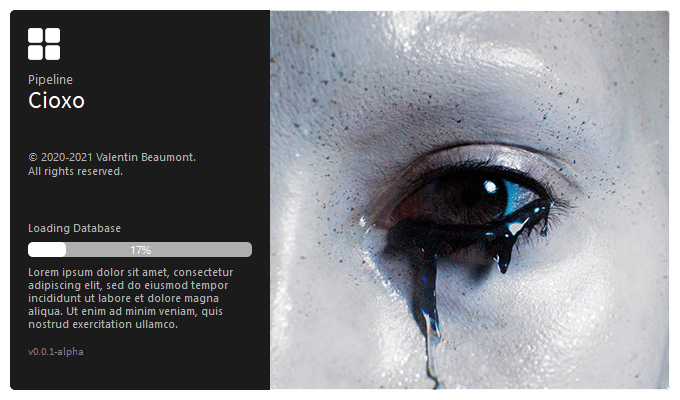

#### WARNING!
---
Cioxo is higlhy unstable as being my first Python project, **Things aren't working as they should**


<div id="top"></div>
<!-- PROJECT LOGO -->
<br />
<div align="center">
  <a href="https://github.com/healkeiser/Cioxo">
    
  </a>

  <h3 align="center">Cioxo</h3>

  <p align="center">
    Cioxo Pipeline
    <br />
    <a href="https://github.com/healkeiser/Cioxo"><strong>Explore the docs »</strong></a>
    <br />
    <br />
    <a href="https://github.com/healkeiser/Cioxo">View Demo</a>
    ·
    <a href="https://github.com/healkeiser/Cioxo">Report Bug</a>
    ·
    <a href="https://github.com/healkeiser/Cioxo">Request Feature</a>
  </p>
</div>


<!-- TABLE OF CONTENTS -->
<details>
  <summary>Table of Contents</summary>
  <ol>
    <li>
      <a href="#about-the-project">About The Project</a>
      <ul>
        <li><a href="#built-with">Built With</a></li>
      </ul>
    </li>
    <li>
      <a href="#getting-started">Getting Started</a>
      <ul>
        <li><a href="#prerequisites">Prerequisites</a></li>
        <li><a href="#installation">Installation</a></li>
      </ul>
    </li>
    <li><a href="#usage">Usage</a></li>
    <li><a href="#roadmap">Roadmap</a></li>
    <li><a href="#contact">Contact</a></li>
    <li><a href="#acknowledgments">Acknowledgments</a></li>
  </ol>
</details>


<!-- ABOUT THE PROJECT -->
## About The Project

Cioxo Pipeline is an under development VFX pipeline for freelancers/small scaled productions. It is only available on Windows at the moment.

<div align="center">
<a href="https://github.com/healkeiser/Cioxo">
    
  </a>
</div>

### Built With

* [PySide](https://github.com/PySide)
* [Qt Designer](https://build-system.fman.io/qt-designer-download)


<!-- GETTING STARTED -->
## Getting Started

In order to make Cioxo work, here is what needs to be done.

### Prerequisites

Here are all the Python libraries you'll need:
* PySide2

  ```sh
  pip install PySide2
  ```
 
* Pillow

  ```sh
  pip install Pillow
  ```

### Installation

A compiled version of Cioxo has been released but it is incomplete (It only contains the **Define Root** and **Project Manager**) and has not been fully tested yet: [Cioxo 0.0.1-alpha release](https://github.com/healkeiser/Cioxo/releases). If you want to use it without the compiled version you'll need to move a few files around.

* Main

  - Extract all the files in a new folder called **_PROJECTS/.pipeline_** located in your **_C:/Users/$USERNAME/Documents_** folder

> :information_source: I use this **_PROJECTS_** folder as my **rootDirectory** (See Usage section)

* Houdini

  - Copy the content of the **otls** folder to your **_C:/Users/$USERNAME/Documents/houdini{$HOUDINI_VERSION}/otls_** folder
  - Copy **MainMenuCommon.xml** to your **_C:/Users/$USERNAME/Documents/houdini{$HOUDINI_VERSION}_** folder

> :information_source: You can also leave them in your .pipeline folder and create a **SymbolicLink** of the files in your **_C:/Users/$USERNAME/Documents/houdini{$HOUDINI_VERSION}_** folder (See [Link  Shell Extension](https://schinagl.priv.at/nt/hardlinkshellext/linkshellextension.html#contact) in Acknowledgments)

> :warning: Cioxo is currently incompatible with **Houdini - Python 3** versions
* Nuke

  - The Nuke integration is still under active development but should be released soon


<!-- USAGE EXAMPLES -->
## Usage

The two main programs are:

* [Define Root](https://github.com/healkeiser/Cioxo/blob/main/all/cioxo_main_defineRoot.py)

**Cioxo - Define Root** needs to run first, it will define the **rootDirectory** of all your projects. 

> :information_source: Note that the **rootDirectory** can be changed at any time by simply running **Cioxo - Define Root** again

* [Project Manager](https://github.com/healkeiser/Cioxo/blob/main/all/cioxo_main_projectManager.py)

Once **Cioxo - Define Root** has created the needed directories and files, you can run **Cioxo - Project Manager**. This program is the heart of the pipeline, centralizing all the projects, sequences, shots, assets, and other useful informations such as the Frame Range, or the Project Resolution. It can also create the files for the included DDCs while the integrations are under development.

Under construction

_For more examples, please refer to the [Documentation](https://example.com) - Under Construction_


<!-- ROADMAP -->
## Roadmap

- [x] **Project Manager**

- [ ] **DCCs integrations**

    - [ ] Houdini
    - [ ] Nuke
    - [ ] Substance Painter
    - [ ] After Effects
    - [ ] Photoshop

- [ ] **Renderers integrations**
  
    - [ ] V-Ray
    - [ ] Redshift

_To see the full roadmap, please visit [Trello](https://trello.com/b/ljWoCtfM)_

<!-- CONTACT -->
## Contact

Valentin Beaumont - [LinkedIn](https://uk.linkedin.com/in/valentin-beaumont) - [Behance](https://www.behance.net/el1ven) - valentin.onze@gmail.com

Project Link: [Cioxo](https://github.com/healkeiser/Cioxo)


<!-- ACKNOWLEDGMENTS -->
## Acknowledgments

List of resources that helped me through it or I found useful:

* [Awesome CG / VFX Pipeline](https://github.com/cgwire/awesome-cg-vfx-pipeline)
* [Link Shell Extension](https://schinagl.priv.at/nt/hardlinkshellext/linkshellextension.html#contact)
