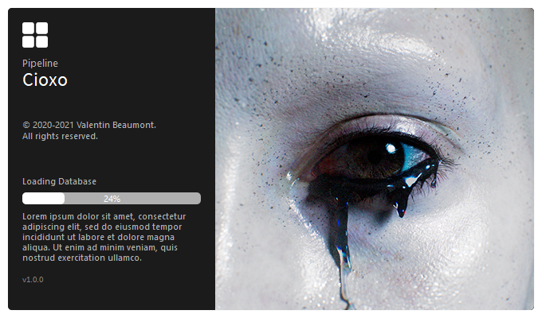

<div id="top"></div>
<!-- PROJECT LOGO -->
<br />
<div align="center">
  <a href="https://github.com/healkeiser/Cioxo">
    
  </a>

  <h3 align="center">Cioxo</h3>

  <p align="center">
    Cioxo Pipeline
    <br />
    <a href="https://github.com/healkeiser/Cioxo"><strong>Explore the docs »</strong></a>
    <br />
    <br />
    <a href="https://github.com/healkeiser/Cioxo">View Demo</a>
    ·
    <a href="https://github.com/healkeiser/Cioxo">Report Bug</a>
    ·
    <a href="https://github.com/healkeiser/Cioxo">Request Feature</a>
  </p>
</div>


<!-- TABLE OF CONTENTS -->
<details>
  <summary>Table of Contents</summary>
  <ol>
    <li>
      <a href="#about-the-project">About The Project</a>
      <ul>
        <li><a href="#built-with">Built With</a></li>
      </ul>
    </li>
    <li>
      <a href="#getting-started">Getting Started</a>
      <ul>
        <li><a href="#prerequisites">Prerequisites</a></li>
        <li><a href="#installation">Installation</a></li>
      </ul>
    </li>
    <li><a href="#usage">Usage</a></li>
    <li><a href="#roadmap">Roadmap</a></li>
    <li><a href="#contact">Contact</a></li>
    <li><a href="#acknowledgments">Acknowledgments</a></li>
  </ol>
</details>


<!-- ABOUT THE PROJECT -->
## About The Project

Cioxo Pipeline is an under development VFX pipeline for freelancers/small scaled productions. 

<a href="https://github.com/healkeiser/Cioxo">
    
  </a>

### Built With

* [PySide](https://github.com/PySide)
* [Qt Designer](https://build-system.fman.io/qt-designer-download)


<!-- GETTING STARTED -->
## Getting Started

In order to make Cioxo work, here is what needs to be done.

### Prerequisites

Here are all the Python libraries you'll need:
* PySide2

  ```sh
  pip install PySide2
  ```

### Installation

A compiled version of Cioxo will be released at some point, but if you want to use it right now you'll need to move around a few files.

* Main

  - Extract all the files in a new folder 

> I called mine **.pipeline** and put it at the root of a **PROJECTS** folder

* Houdini

  - Copy the content of the **otls** folder to your _C:\Users\$USERNAME\Documents\houdini{$HOUDINI_VERSION}\otls_ folder
  - Copy **MainMenuCommon.xml** to your _C:\Users\$USERNAME\Documents\houdini{$HOUDINI_VERSION}_ folder

> You can also leave them in your .pipeline folder and create a **SymbolicLink** of the files in your _C:\Users\$USERNAME\Documents\houdini{$HOUDINI_VERSION}_ folder (See [Link  Shell Extension](https://schinagl.priv.at/nt/hardlinkshellext/linkshellextension.html#contact) in Acknowledgments)

* Nuke

  - The Nuke integration is still under active development but should be released soon


<!-- USAGE EXAMPLES -->
## Usage

The two main programs are:

* [Define Root](https://github.com/healkeiser/Cioxo/blob/main/all/cioxo_main_defineRoot.py)

**Cioxo - Define Root** needs to run first, it will define the **rootDirectory** of all your projects. 

> Note that the **rootDirectory** can be changed at any time by simply running **Cioxo - Define Root** again

* [Project Manager](https://github.com/healkeiser/Cioxo/blob/main/all/cioxo_main_projectManager.py)

Once **Cioxo - Define Root** has created the needed directories and files, you can run **Cioxo - Project Manager**. This program is the heart of the pipeline, centralizing all the projects, sequences, shots, assets, and other useful informtations such as the Frame Range, or the Project Resolution. It can also create the files for the included DDCs while the integrations are under development.

Under construction

_For more examples, please refer to the [Documentation](https://example.com)_


<!-- ROADMAP -->
## Roadmap

- [x] **Project Manager**
    - [x] Projects
    - [x] Assets
    - [x] Sequences
    - [x] Shots
    - [x] Frame Range
    - [x] Resolution
    - [x] Thumbnail
    - [x] Comment

- [ ] **DCCs integrations**

    - [ ] Houdini

        - [ ] Open Workspace
        - [x] Publish Workspace
        - [x] Help
        - [x] About

    - [ ] Nuke

        - [ ] Cioxo Gather
        - [ ] Cioxo Write
    
    - [ ] Substance Painter
    
    - [ ] After Effects
    
    - [ ] Photoshop

- [ ] **Renderers integrations**
  
    - [ ] V-Ray
    - [ ] Redshift


<!-- CONTACT -->
## Contact

Valentin Beaumont - [LinkedIn](https://uk.linkedin.com/in/valentin-beaumont) - [Behance](https://www.behance.net/el1ven) - valentin.onze@gmail.com

Project Link: [Cioxo](https://github.com/healkeiser/Cioxo)


<!-- ACKNOWLEDGMENTS -->
## Acknowledgments

List of resources that helped me through it or I found useful:

* [Awesome CG / VFX Pipeline](https://github.com/cgwire/awesome-cg-vfx-pipeline)
* [Link Shell Extension](https://schinagl.priv.at/nt/hardlinkshellext/linkshellextension.html#contact)
